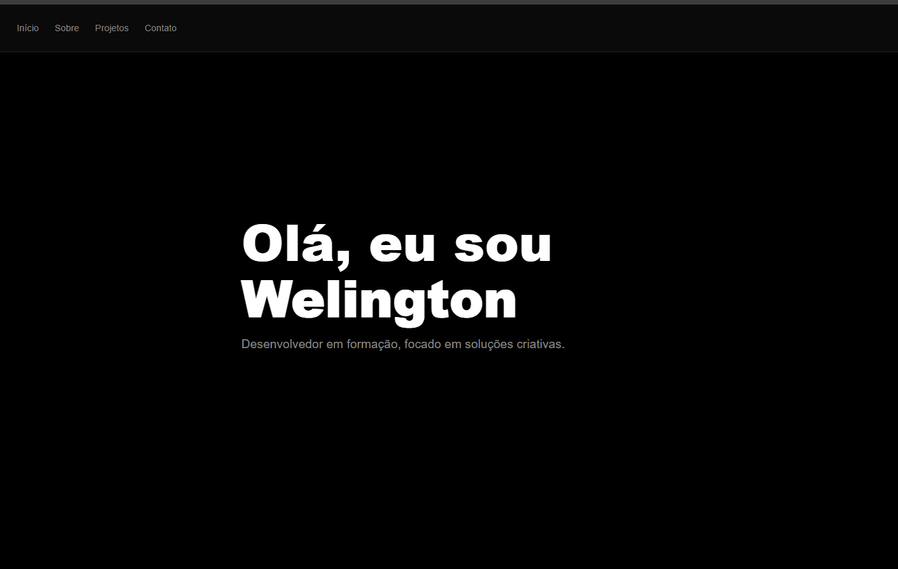

# Portfólio Pessoal - Welington Santos

Este repositório contém o código do meu primeiro site de portfólio.
Ele foi desenvolvido com o objetivo de consolidar meus conhecimentos em HTML5 e CSS3, servindo como um hub central
para exibir meus futuros projetos e informações de contato.

Fique a vontade para olhar meu código.
---
## Tecnologias e Ferramentas Utilizadas

* Editor: [Sublime Text 4, build 4200](https://www.sublimetext.com/)
* HTML5: Estruturação semântica do conteúdo.
* CSS3: Estilização com foco em design minimalista (Dark Mode).
   * Flexbox & Grid: Utilizados para o layout da navegação e a grade de projetos.
   * Responsividade: Uso de @media queries e clamp() para adaptação em dispositivos móveis.
* Font Awesome: Ícones para redes sociais e interface.
* Google Fonts: Tipografia moderna usando a fonte 'Inter'.

## Funcionalidades do Site

* Design Minimalista: Interface escura com alto contraste e foco em tipografia.
* Navegação Fixa: Menu que acompanha a rolagem da página para facilitar o acesso.
* Seções Estruturadas:
   * Hero Section: Apresentação inicial impactante.
   * Sobre: Breve resumo sobre minha trajetória.
* Projetos: Grid interativo para exibição de cards de projetos futuros.
* Contato: Links diretos para GitHub, LinkedIn e Instagram com efeitos de hover.

## Próximos Passos
 Pretendo atualizar este portfólio constantemente conforme eu avançar em meus estudos de:

[ ] JavaScript (para interatividade)
---
[ ] Frameworks de Front-end (React)
---
[ ] Adição de projetos reais no Grid.
---

## Desenvolvido por: [Welington Santos](https://www.linkedin.com/in/welington-santos-25a3182b6/)
